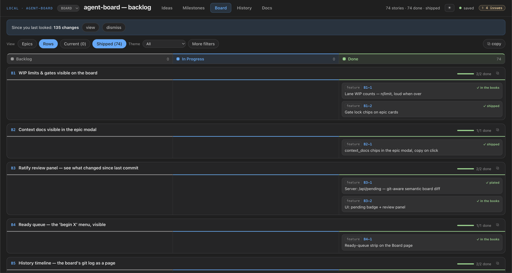
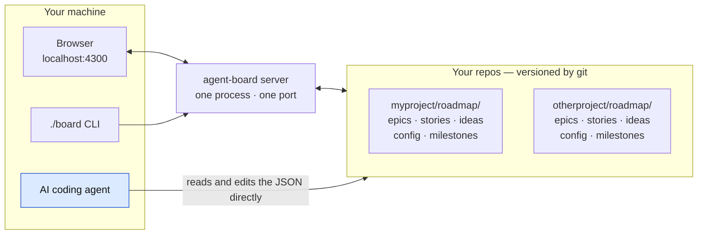
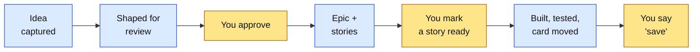

# agent-board

**Two boards your AI coding agent can read: an ideas funnel for deciding what to build, and a kanban for building it — both stored as plain JSON in your own repo.**


Stop re-explaining your project at the start of every AI session. Point your
agent at a board it can read, and it will tell you what to work on next, shape
a rough idea until it's decidable, break the approved ones into stories, and
build the ones you mark ready — moving the cards as it goes.



---

## Quick start

```bash
git clone https://github.com/riverpickles22/agent-board.git
cd agent-board
./board new myproject ~/code/myproject/roadmap   # scaffold + register
./board myproject                                # serve it
```

Open <http://localhost:4300>. That's the whole install — no package manager, no
build step, no database. `Ctrl+C` stops it, or `./board stop` from any directory.

Full walkthrough, including connecting your agent: **[Setup](#setup)** below.

---

## Why this exists

You paste context, the agent proposes work you rejected last week, and the
decision of *what to build next* never leaves your head — so the one thing an
agent can't help with is the thing that actually gates your progress.

A board only fixes that if the agent can read it. Hosted trackers put
your backlog behind an API and a login. agent-board puts it in your repo as five
JSON files, so the agent reads it the same way it reads your source — and every
change lands in a diff you review like any other.

**What it is not:** a team tool. No accounts, no permissions, no server to
deploy. It binds to `127.0.0.1` and assumes one person per board.

---

## Features

| | |
|---|---|
| **Two surfaces, one backlog** | An ideas funnel for deciding, a kanban for building, and one recorded moment between them |
| **Plain JSON, in your repo** | Five files per project, versioned by the repo they belong to |
| **No dependencies** | Node 18+ and nothing else. No `npm install`, no lockfile, no supply chain |
| **Many projects, one server** | One process serves every registered board on one port, with a switcher in the header |
| **Agent-readable contract** | `AGENTS.md` has the schemas and edit rules; `PROTOCOL.md` has the "what's next" rule. Both served over HTTP |
| **Same answer for both of you** | The queue you see is the selection rule the agent runs — `./board next` prints it |
| **Built-in validator** | `./board doctor` checks your data against the contract, exit 1 on errors, so it can gate CI |
| **Live reload** | Edit the JSON and open pages update within a second — you watch the agent move cards in real time |
| **Git is the save button** | No database. Saving a board is a commit in that project's repo |

---

## The two boards

The split is the whole design. **Ideas asks "what might this become." Board asks
"what are we building."** Keeping them apart is what stops a wish list from
looking like committed work.

### Ideas — the funnel

Not a second kanban. A funnel, where every stage answers one of two questions:
*how much do we believe in this*, and *is it defined enough to graduate?*

```mermaid
flowchart LR
    C["Capture<br/>press n"]:::gray --> BB["Back burner<br/>parked, preserved"]:::gray
    BB --> FB["Front burner<br/>being shaped"]:::blue
    FB --> RR["Ready for review<br/>decision needed"]:::amber
    RR --> RI["Ready to implement<br/>intent settled"]:::green
    RI --> P["Promote to Board"]:::board
    P --> E["Epic + stories"]:::board

    classDef gray fill:#e5e7eb,stroke:#6b7280,color:#111
    classDef blue fill:#dbeafe,stroke:#1d4ed8,color:#111
    classDef amber fill:#fde68a,stroke:#b45309,color:#111
    classDef green fill:#bbf7d0,stroke:#15803d,color:#111
    classDef board fill:#fff,stroke:#111,color:#111,stroke-width:2px
```



Those colours are the app's, not decoration: **a card's left edge is its
maturity**, and it's the only colour on the card, so the stage reads at a
glance. Red means rejected and nothing else.

| Stage | Means |
|---|---|
| **Back burner** | Interesting and kept, but not worth design time now |
| **Front burner** | Worth actively shaping; questions and approach still open |
| **Ready for review** | Shaped. All that remains is your decision: pursue, revise, defer, reject |
| **Ready to implement** | Intent is settled enough to become executable work |

**Cards grow as they mature** instead of being rewritten. A back-burner card is
a title, a one-sentence outcome and a bet. Front burner adds why-now, what it
waits on, and **Opens** — the inverse of dependencies, so you can see which
ideas unlock others. A review card leads with **Decision needed**. A ready card
states its constraints and acceptance boundary.

**Three lenses** read the same backlog different ways:

| Lens | Shows |
|---|---|
| **Status** | The pipeline above — the default |
| **Theme** | One column per theme |
| **Leverage** | Layered by what unlocks what: *Foundations* first, then the tiers they make possible, *Standalone* last. Computed from the ideas' own dependencies; a cycle is named, not silently broken |

Rejected ideas are kept with a reason, never deleted — they and `done` sit
behind an archive toggle. Each idea has a deep-dive page: context, pros and
cons, a decision lens (effort × impact, quick-win, compounding), and a dated
brainstorm log. **⧉ copy** puts the whole case on your clipboard as markdown,
for running it past a second tool.

**⇥ Promote to Board** is the boundary — the one recorded moment an idea becomes
committed work. It **requires a validation plan**: an idea cannot cross until it
says how the change would be checked. That plan becomes the epic's `test_plan`,
so every committed card already answers "how would we know this works."

### Board — the agent kanban

Committed work. It answers four questions: *what can an agent start now, what's
running, what needs a human, what's blocked.*

At the top, a **work queue** renders the same selection rule the agent protocol
uses — so you and your agent never disagree about what's next. It reads
`Ready to pick up · N`, or `Agent working` naming the owner and how long ago
they claimed it, or why nothing is available.

| On a card | Meaning |
|---|---|
| `⊸ ✓F2 F4` | Dependencies; ticked ones are done |
| `⛔ gated: security` | Closed gate — waits until you list it in `open_gates` |
| `claimed: <session>` | An agent holds it. Claims show their age, turn amber past 48 hours, and release in one click |
| `⚠ needs decision` | The card is waiting on **you**, with the question on the card. The one state that other work can't resolve |
| `3 stories · 1 ready` | Story roll-up; `ready` is your flag, never the agent's |

A **dependency guard** blocks a card from reaching the done lane before its
dependencies, and stops a dependency leaving while its dependents are done.
**WIP limits** show as `3/2` and go red when over. Lane colour is positional —
gray queued, accent active, amber review, green done — so any lane vocabulary
works.

**Two modes, one board.** *Epics* is the default. *Rows* switches the same area
to story swimlanes — one row per epic, its stories draggable across the same
lanes. Your preferred mode saves with the default view.

Finished work gets out of the way: an epic whose stories are all done folds to
one line and offers **⌂ Remove from board**, which moves it to the Shipped view
and closes the idea it grew from in one click. Milestones and dependencies still
count it. Archiving hides; it never deletes.

Stories carry **How to test this yourself** — numbered steps in plain words,
written for whoever didn't build it. `doctor` flags a story sitting in review
without them.

### The other three tabs

| Tab | Answers |
|---|---|
| **Milestones** | What are we trying to finish, and when? Summary, user outcome, exit criteria, and deliverables that roll up to epic chips with live done-counts. <kbd>←</kbd>/<kbd>→</kbd> step through them |
| **History** | What changed, and when? The data directory's git log as a timeline |
| **Docs** | The capability tour, rendered in the UI |

Press <kbd>/</kbd> anywhere to jump to any card, <kbd>n</kbd> to capture an idea.
Hover any card for a second to peek at everything it had no room for.

---

## How it works

One codebase, many boards. The board code lives in this repo once; each
project's data lives in that project's own repo.



The agent doesn't need the server running — it edits the JSON directly under the
rules in `AGENTS.md`. The server is for *you*: to look at the board, and to
watch cards move while the agent works.

---

## Working with an AI agent

Every card is a file the agent can read, and the board records which decisions
are yours alone.



**Blue: the agent does it. Amber: only you do it.** The agent can research an
idea and hand it over saying "this is ready for your decision" — but it cannot
approve the idea, declare a story ready to build, or commit. Those three gates
are yours.

With [Claude Code](https://claude.com/claude-code), `./board install` sets up a
skill that activates on its own when you talk about backlog work:

| You say | What happens |
|---|---|
| "What should I work on next?" | Applies the rule in `PROTOCOL.md` and names one card, with its blockers |
| "Capture an idea: …" | Lands it in the funnel at the right stage |
| "Break this request into stories" | Drafts an epic and stories with acceptance criteria, for you to approve |
| "Clean up the backlog" | Groups related work, fills in thin cards, flags epics that drifted from your docs |
| "Begin F2-1" | Claims the story, reads its context, writes the code and tests, moves the card |
| "Save the board" | Commits the data directory |

Other agents work too — point them at `AGENTS.md` and `PROTOCOL.md`, which a
running server also serves at `/AGENTS.md`, `/PROTOCOL.md`, and `/llms.txt`.

---

## Setup

**Requirements:** Node.js 18 or newer, macOS or Linux (Windows via WSL), and
`git` if you want the History tab and the save step.

### 1. Get the code

```bash
git clone https://github.com/riverpickles22/agent-board.git
cd agent-board
```

Nothing to install. Verify with `node --version` — 18 or higher.

### 2. Create a board for a project

Point it at a directory in the repo whose backlog it holds. A design or docs
repo is a good home; so is a `roadmap/` folder in the code repo itself.

```bash
./board new myproject ~/code/myproject/roadmap
```

That creates the five JSON files with working defaults, registers the name, and
warns you if the directory isn't inside a git repository. It **adopts** an
existing directory without overwriting anything, so it's safe to re-run.

Registration lands in `projects.json`:

```json
{
  "myproject": "/Users/you/code/myproject/roadmap"
}
```

That file holds absolute paths for one machine, so it's **gitignored**. A fresh
clone has none — `./board new` writes it, or copy `projects.example.json`.

### 3. Serve it

```bash
./board myproject        # every registered board, opening on this one
```

Open <http://localhost:4300>. Add more projects with another `./board new`; one
server serves them all, and a switcher appears in the header.

### 4. Put `board` on your PATH (optional, once)

```bash
./board install
```

Symlinks the launcher into `~/.local/bin` so `board` works from any directory,
and installs the Claude Code skill. Set `BOARD_BIN_DIR` to use a different
directory.

After this, plain `board` asks which project to open and remembers your answer.
`board default <name>` changes it; `board default --none` clears it.

### 5. Connect your agent

For Claude Code, step 4 already did it — the skill is a symlink into this repo,
so it updates when you `git pull`, and new sessions pick it up with no action
from you. It activates on its own when you talk about backlog work.

For any other agent, give it `AGENTS.md` and `PROTOCOL.md` and tell it which
directory holds the board. A running server serves both at `/AGENTS.md` and
`/PROTOCOL.md`.

### 6. Make the vocabulary yours

Edit `config.json` in the data directory — lanes, priorities, themes,
milestones. Nothing is hardcoded in the app. See
[Configuration](#configuration) for every key.

### 7. Save

Board edits are just file edits. When you're happy, commit the data directory —
that's the save. The header counts unsaved changes and the History tab shows
every past commit as a timeline.

```bash
cd ~/code/myproject && git add roadmap && git commit -m "Board: plan M1"
```

Or tell your agent "save the board."

---

## CLI reference

```bash
board                       # open your default board
./board <name>              # serve all boards, opening on <name>
./board <name> --only       # serve only <name>, on unprefixed routes
./board stop [port]         # stop the board on a port (default 4300)

./board list                # registered projects and their data dirs
./board default <name>      # set the default board (--none clears it)
./board install             # add to PATH + install the Claude skill

./board status <name>       # what needs you, what's in flight, health
./board next <name>         # the pickable queue
./board doctor <name>       # validate against the contract (exit 1 on errors)
./board new <name> <dir>    # scaffold and register a project
./board help                # everything
```

`status` and `next` take `--json`. **The CLI never edits board data** — `new` is
the one writer, and it only scaffolds a new project. Changing a card means
editing the JSON, by hand or by agent.

### Environment variables

| Variable | Effect |
|---|---|
| `PORT` | Port to serve on (default `4300`) |
| `BOARD_DATA_DIR` | Pin the server to one data directory and drop the URL prefix |
| `BOARD_DEFAULT` | Override the default board for a single run |
| `BOARD_BIN_DIR` | Where `./board install` puts the symlink (default `~/.local/bin`) |

---

## Configuration

Every vocabulary is per-project — the app hardcodes none of it. Edit
`config.json` in the project's data directory:

| Key | Type | Default | What it does |
|---|---|---|---|
| `lanes` | string[] | `Backlog, In Progress, Review, Done` | Your columns. **First is the todo lane, last is the done lane** — the dependency rules key off position, not name |
| `priorities` | string[] | `Now, Next, Later, Someday` | Priority tiers, highest first. The top half is "front burner" in the Ideas funnel |
| `themes` | string[] | `[]` | Groupings for epics and ideas |
| `milestones` | string[] | `[]` | Milestone names epics can belong to |
| `open_gates` | string[] | `[]` | Gates you have opened. A gated epic stays closed until its gate is listed here — only you add one |
| `wip_limits` | object | `{}` | Per-lane card limits, e.g. `{"In Progress": 3}` |
| `view.title` | string | `"Board"` | Board name in the header and browser tab |
| `view.default_page` | string | `"board"` | Tab to open on: `ideas`, `milestones`, `board`, `history`, `docs` |
| `view.default_milestone` | string | `"all"` | Milestone filter applied on open |
| `view.default_theme` | string | `"all"` | Theme filter applied on open |
| `view.default_board_mode` | string | `"epics"` | `epics` or `rows` |

Set the filters you like in the UI and click **★ set as default view** to write
them back.

### The five data files

| File | Holds |
|---|---|
| `ideas.json` | The funnel, including rejected ideas and why |
| `epics.json` | Epics: theme, milestone, priority, dependencies, systems touched, context docs, test plan |
| `stories.json` | Buildable slices: acceptance criteria, how to test, context, `ready` flag |
| `milestones.json` | Milestone narrative and deliverables |
| `config.json` | The vocabularies above |

Full schemas and edit rules: **[AGENTS.md](AGENTS.md)**. An empty directory is
valid — every file has a working default.

---

## Troubleshooting

| Symptom | Fix |
|---|---|
| `Port 4300 is already in use` | A board is already running — probably the one you want. `./board stop 4300`, or run alongside with `PORT=4301 ./board <name>` |
| `board: command not found` after `./board install` | `~/.local/bin` isn't on your `PATH`. Add it, or set `BOARD_BIN_DIR` to a directory that is |
| `Unknown project: <name>` | Not registered. `./board list` to see what is, `./board new <name> <dir>` to add it |
| `Data directory for '<name>' not found` | The path in `projects.json` is stale — edit it |
| History tab is empty | The data directory isn't in a git repository, or has no commits yet |
| Board looks empty | Expected for a new project. `./board doctor <name>` confirms the files are valid |
| Edits don't show in the browser | The server watches the data directory; check you edited the one in `projects.json`, not a copy |
| An agent claimed a card and vanished | Claims turn amber past 48 hours — release it in one click wherever it appears |

---

## Documentation

| Document | Audience |
|---|---|
| **[AGENTS.md](AGENTS.md)** | Agents. Schemas, edit rules, the build loop |
| **[PROTOCOL.md](PROTOCOL.md)** | Agents. The rule for picking the next card |
| **[CAPABILITIES.md](CAPABILITIES.md)** | Everyone. One-page tour of what the tool does |
| **[design/](design/DESIGN.md)** | Contributors. One spec per screen, with wireframes |

---

## Contributing

Issues and pull requests welcome. The codebase is deliberately small and
dependency-free; please keep it that way.

The UI is defined by the specs in `design/` — one per screen, each with a
wireframe. Change a screen by editing its spec first, then making `index.html`
match, so the specs stay a true picture of the app.

Run `./board doctor <name>` before opening a PR. It exits non-zero on real
errors and zero on advice.

## License

[MIT](LICENSE)
